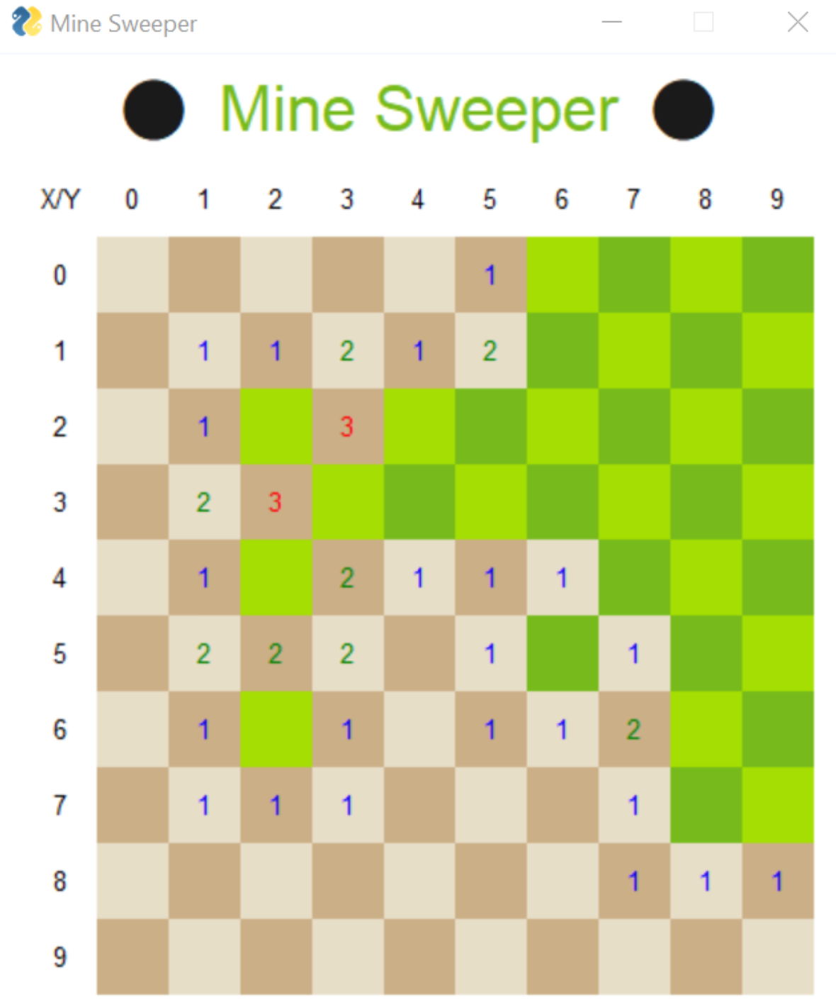
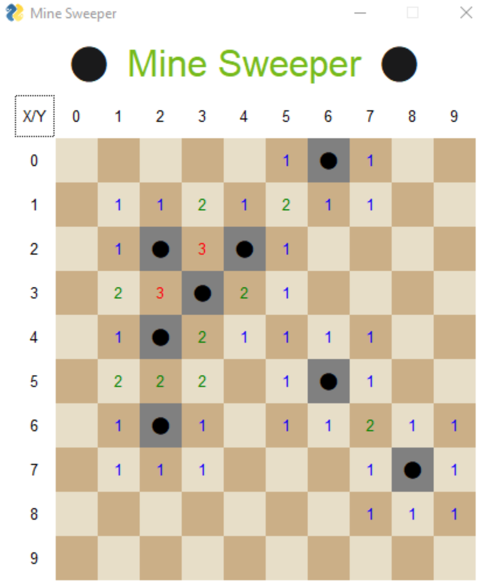
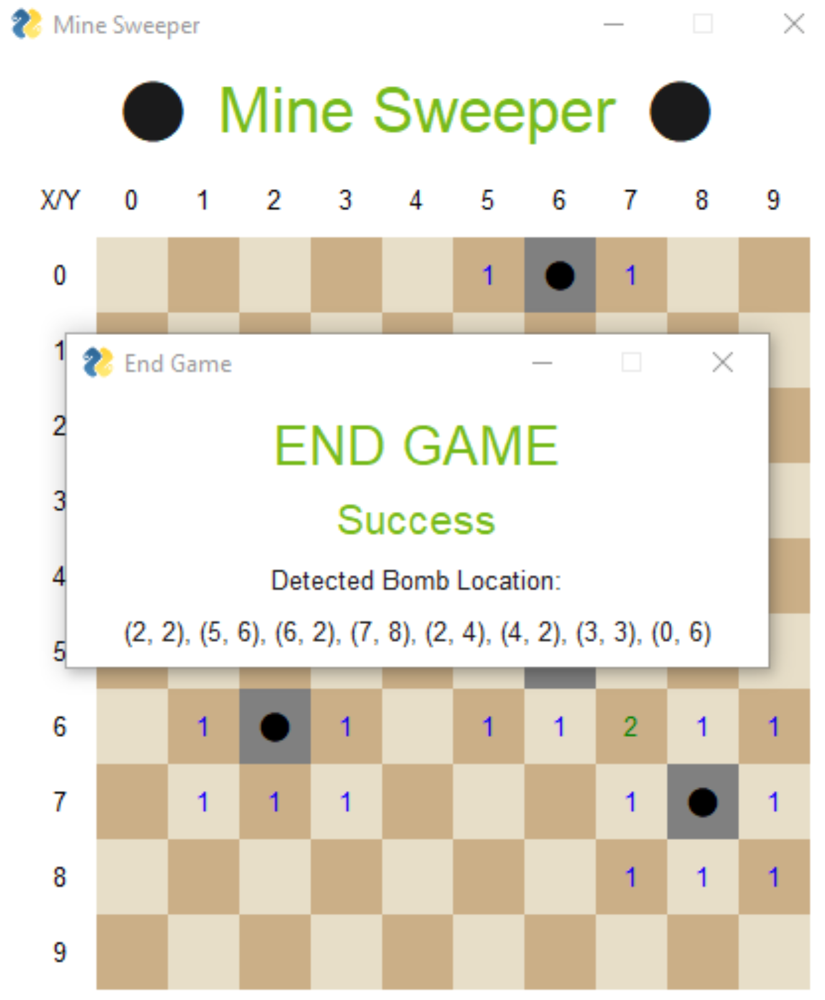
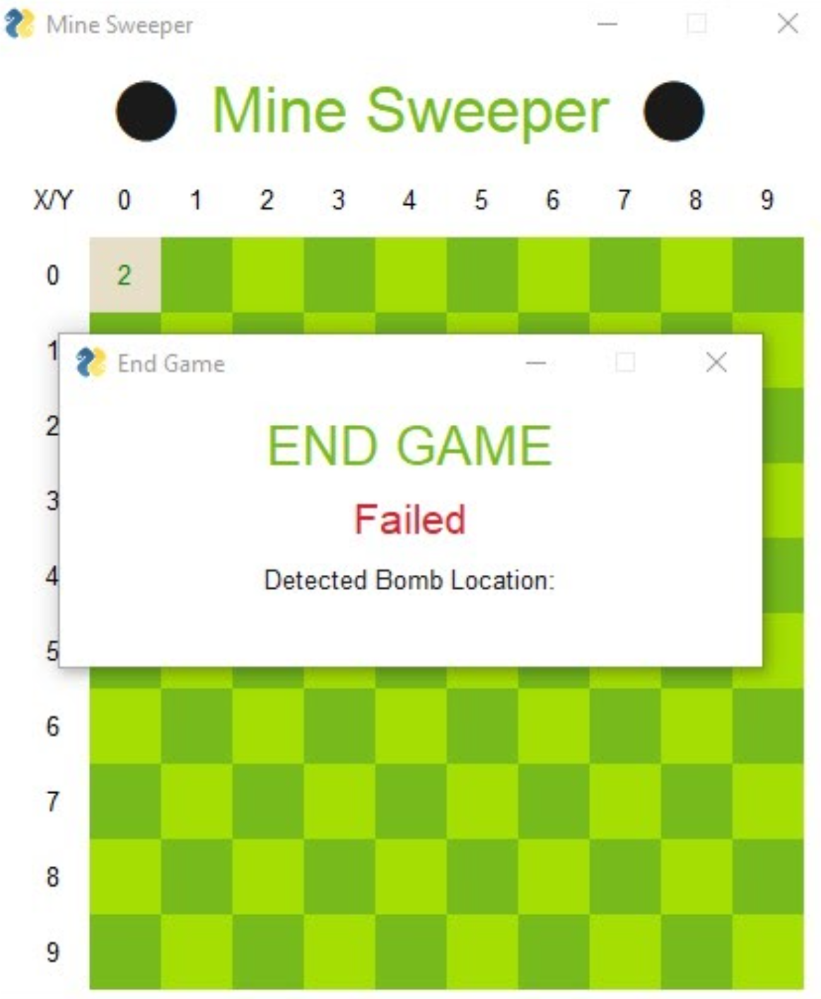

# 💣 Minesweeper using CLIPS 💣
This repository is a project to make a game called Minesweeper which is played by 1 person with the objective of the game is to clear a rectangular board containing hidden "mines" or bombs without detonating any of them, with help from clues about the number of neighboring mines in each field. This program is made with python and CLIPS. This program includes GUI using pysimplegui

## ⚙️ Config
```
{board_size}
{total_bomb}
{bomb_coordinate}
```
Example
```
10
8
0, 6
2, 2
2, 4
3, 3
4, 2
5, 6
6, 2
7, 8
```

## 📖  How to Run

1. Install virtualenv if you haven't
```
pip install virtualenv
```
2. Create virtualenv
```
virtualenv venv
```

3. Activate the created virtualenv
```
venv\Scripts\activate
```

4. Install dependencies
```
pip install -r requirements.txt
```

5. Run
```
python main.py [CONFIG]
```
CONFIG is config file that located in config folder. For example: config.txt

## 📷 Screenshot
| Condition | Image | 
|------|---------|
| InGame |  |
| EndGame |  |
| Success Pop Up |  |
| Failed Pop Up |  |


## 📌 Note
if you got this error:
```ModuleNotFoundError: No module named 'Tkinter'```<br/>
You might need to install for your specific version, because a virtualenv in python 3.7 may not importing tkinter. You would have to install it for that version specifically. Use this command:<br/>
```sudo apt-get install python3-tk```


## ✍ Author
- Jovan Karuna Cahyadi / 13518024 / K-1
- Tony Eko Yuwono / 13518030 / K-1
- Felicia Gojali / 13518101 / K-3
- Stefanus Stanley Yoga Setiawan / 13518122 / K-3

## ✔️ Acknowledgement
This project is used for an assignment from IF3170 Artificial Intelligence
